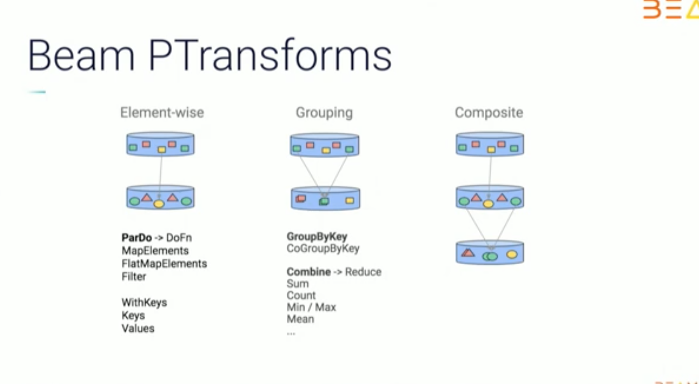

# Prueba de Concepto usando Dataflow

## Conceptos Básicos en Apache Beam

A continuación se presenta un diagrama de cómo se representa un pipeline en Apache Beam.


### PCollection

Un "PCollection" es básicamente la representación de un conjunto de datos. Estos datos pueden ser por ejemplo un conjunto de registro dentro de un archivo csv, o un stream de datos (datos ilimitados que vienen de un pub sub).

Como vemos en el diagrama, a un PCollection se le aplicaría un "transform", el cual es una funcion que se le aplicaría a cada elemento dentro de nuestro PCollection,  lo que nos daría finalmente como resultado otro PCollection.

### Transform

Los "transforms" permiten como su nombre lo dice, aplicar transformaciones a nuestro PCollection. Existen implementaciones comunes ya implementadatas en Apache Beam que se pueden utilizar (y es recomendable, ya que estan optimizadas para usar paralelismo). Estas se pueden ver en el siguiente [enlace](https://beam.apache.org/documentation/programming-guide/#applying-transforms).



- ParDo: 
    es un tipo de transformación **genérico** que permite el procesamiento en paralelo de todos los elementos de un PCollection.

    Una transformación ParDO debe de recibir una clase **DoFn** que debemos de implementar noosotros mismos. A continuación se presenta un ejemplo de nuestra clase DoFn para convertir un registro de nuestro csv que esta en string a un objeto python.

    ```python
    # File: src/classes/etl_winery_list.py
    
    class FormatElementToObjectDoFn(beam.DoFn): # <-- Esta clase que creemos DEBE 
                                                #     DE HEREDAR de la clase beam.DoFn
    
    def process(self, element):     # <-- Nuestra clase DEBE DE IMPLEMENTAR un método 
                                    #     llamado "process" que reciba como parametro 
                                    #     un elemento del PCollection 

                                    #     ParDo nos da individualmeente los elementos del PCollection, 
                                    #     para que nosotros SOLO TENGAMOS QUE implementar "la trasformacion" 
                                    #     que será aplicada a cada elemento de la coleccion

                                    # Un ejemplo de un elemento podría ser el string
                                    # "0,Heitz,Cabernet Sauvignon,California,US,96,235.0"
                                    # el cual luego nuestra la funcion lo convertiría en un objeto 
                                    # {
                                    #    'id': 0,
                                    #    'winery': Heitz,
                                    #    'variety': Cabernet,
                                    #    'province': Sauvignon,
                                    #    'country': California,
                                    #    'points': US,
                                    #    'price': 235.0
                                    # }

                                    # Esta clase "FormatElementToObjectDoFn" haría este trabajo computacional a cada elemento del PCollection

        el = [ '{}'.format(x) for x in list(csv.reader([element], delimiter=',', quotechar='"'))[0] ]
        try:
            yield {                 # <-- yield es similar a return. Es necesario que nuestra clase retorne 
                                    #     este elemento (ya le aplicamos la transformacion en este punto), 
                                    #     para que forme parte del output, es decir otro PCollection
                'id': int(el[0]),
                'winery': el[1],
                'variety': el[2],
                'province': el[3],
                'country': el[4],
                'points': int(el[5]),
                'price': float(el[6]) if el[6] != '' else 0
            }
        except Exception as e:
            yield beam.pvalue.TaggedOutput('error', element)  # <-- Aca le ponemos una etiqueta al registro que no se pudo 
                                                              #     parsear correctamente, ya sea porque el registro 
                                                              #     haya estado mal redactado.

            logging.error('Error parsing: {error} -> {element}'.format(error=e, element= element))
    ```

- Composite transforms:
    las transformaciones pueden tener una estructura anidada, donde una transformación compleja realiza múltiples transformaciones más simples (como más de un ParDo, Combine, GroupByKey o incluso otras transformaciones compuestas). Estas transformaciones se denominan transformaciones compuestas. Anidar múltiples transformaciones dentro de una única transformación compuesta puede hacer que su código sea más modular y más fácil de entender.

    A continuacion mostramos un ejemplo de como juntamos varios transforms en una sola clase llamada WineryListEtl. Te darás cuenta que varias clases transformadoras que se usan se encuentran en el mismo SDK de beam, generalmente las identificas facilmente porque comienzan com beam.*  .

    ```python
    # File: src/classes/etl_winery_list.py
    class WineryListEtl(beam.PTransform):   # <-- Nuestra clase debe de heredar necesariamente
                                            #     la clase beam.PTransform

        def expand(self, pcoll):            # <-- Se debe de implementar la funcion expand,
                                            #     el cual a diferencia del DoFn, este recibe todo el PCollection, 
                                            #     en vez de un elemento individual

            data = (
            pcoll
            | 'Read winery list csv' >> ReadFromText(self.input_files, skip_header_lines=True)
            | 'Transform string line to an object' >> beam.ParDo(FormatElementToObjectDoFn()).with_outputs('error', main='formated_pcoll')
            )

            # Data OK
            formated_pcoll = data['formated_pcoll']

            (
            formated_pcoll 
            | 'Format to string' >> beam.ParDo(FormatElementToStringDoFn())
            | 'Write winery data to csv' >>  WriteToText(self.output_raw, file_name_suffix='.csv', header='id,winery,variety,province,country,points,price')
            )

            # Creamos un dataframe a partir del PCollection
            (formated_pcoll
                | 'Convert Pcoll into a list' >> beam.combiners.ToList()
                | 'Convert list into a dataframe' >> beam.Map(lambda element_list: pd.DataFrame(element_list))
                | 'Insert into database' >> beam.ParDo(InsertDB(self.db))
            )

            # Data con error
            error  = data['error']
            (
            error 
            | 'Write lines with errors in a file' >>  WriteToText(self.output_error, file_name_suffix='.txt')
            )

            return pcoll

    ```
    Basicamente se muestra un diagrama de lo que hace la clase anterior
    


### Archivo main.py

En el archivo main.py es donde justamos todos tasks - etls creados y los ejecutamos en un solo pipeline de dataflow.

```python
def run(argv=None):
    parser = argparse.ArgumentParser()
    known_args, pipeline_args = parser.parse_known_args(argv)

    # Con esto creamos el primer PCollection (vacio) para iniciar
    # el pipeline
    p = beam.Pipeline(options=PipelineOptions(pipeline_args))

    db = Database(
        host='ec2-34-235-62-201.compute-1.amazonaws.com',
        dbname='d8hsl7f3pqpmpt',
        user='wocmkztqpfdrzf',
        password='352719f3bd91b730f54fa37ec7c7ae3e6f54c5c6d9292b38d51991a7ba965cc5')

    gs_path = 'gs://alo_dataflow_test'
    time_string = datetime.now().strftime("%Y%m%d_%H%M")

    # Definimos la secuencia del pipeline
    # invocando WineryListEtl y SalesWeeklyEtl 
    (
        p
        | 'Winery list ETL' >> WineryListEtl(db, gs_path,time_string)
        | 'Weekly sales ETL' >> SalesWeeklyEtl(db, gs_path,time_string)
    )

    # Corremos el pipeline
    p.run().wait_until_finish() 

if __name__ == '__main__':
    logging.getLogger().setLevel(logging.INFO)
    run()
```

## Arquitectura Planteada

Este es el flujo que se seguirá a más alto nivel. El dataflow leerá csvs ubicados en un bucket de GCS y hará dos tareas en paralelo. El primero hará unos inserts a un postgres y la otra tarea será juntar todos los registros en un csv individual y los subira en otra carpeta del mismo bucket.


## Proceso de Despligue del pipeline de Apache Beam en Dataflow

Básicamente a continuación se muestra el proceso que se sigue para tener desplegado el pipeline en Dataflow.


Se crearon varios comandos en el Makefile que permiten ya de manera automatica hacer este proceso de despliegue.
- Desplegar pipeline
    - **make gcp-build-push-docker**: este comando permite crear una imagen docker de nuestro pipeline y la sube a la plataforma de google cloud registry
    - **make gcp-create-dataflow-template**: este comando permite crear un template en formato .json (depende de la imagen docker creada previamente), el cual es guardado luego en un cloud storage.


- Crear un Scheduler que invoque el pipeline desde dataflow
    - **gcscheduler**: este comando crea un scheduler que invoca el pipeline en dataflow por medio de un **HTTP POST** al API de Dataflow. Para mayor información consultar el [la documentacion del API de Google Dataflow](https://cloud.google.com/dataflow/docs/reference/rest)
    - **gcscheduler-run**: ese comando invoca el scheduler de manera manual.


** Dataflow para ejecutar el pipeline busca el template que debe de estar en un butcket de GCS.

## Anexos
Estas son algunas refencias y codigos fuentes que me parecieron interesantes e importantes para poder realizar el ejemplo anterior.

- https://github.com/apache/beam/tree/master/sdks/python/apache_beam/examples
- https://beam.apache.org/get-started/wordcount-example
- Hay un conjunto de archivos de codigo fuente de otros proyectos que he ido recopilando y almacenando. Se encuentra en la carpeta "code_examples".
